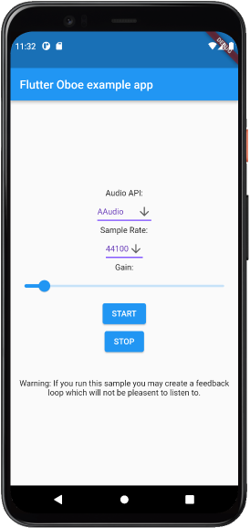

# Flutter bindings for Oboe library
<p align="center">

</p>
<br>
Example Flutter application implementing a wrapper for the C++ Google Oboe (LiveEffect Sample) library via dart:ffi. 
Target is to reach a minimum audio latency for microphone to speaker passthrough with Flutter on Android.

In the GUI settings the used Audio API (AAudio or OpenSL ES), the sample rate and the amplification can be selected. 
The programming interface also allows to select the recording and playback device_id and the framesPerBurst.  
The microphone recording with simultaneous speaker playback can be started by pressing the start button.<br><br> 

Processing of the recorded microphone samples, before sending it as output signal to Oboe, can be performed in C++ in android/app/src/main/cpp/FullDuplexStream.h
For this a callback function is registered in Oboe allowing access to the input and output samples. 
The output samples are then asynchronous send over a NativePort between C and Dart and shown in Flutter in the oscilloscope chart.  

To build the application the Oboe library is dynamically linked via CMake in android/app/CMakeLists.txt.  
Following commands are required:
```
git clone --recursive https://github.com/pffelix/flutter_oboe
cd flutter_oboe
flutter pub get
flutter run lib/main.dart
```

Thanks goes to Richard Heap for his tutorial on dart:ffi https://www.youtube.com/watch?v=X8JD8hHkBMc&t=1380s  
The futher goal of the project might be to develop more comprehensive low latency audio recording bindings for Flutter (if there is interest and more contributors want to join).