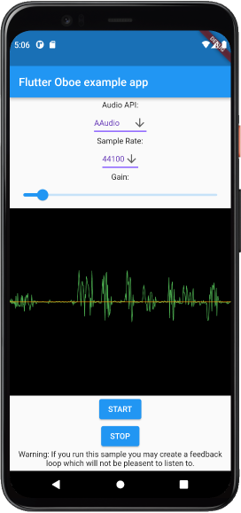

# Flutter bindings for Oboe library

 
Example Flutter application implementing a wrapper for the C++ Google Oboe (LiveEffect Sample) library via dart:ffi. 
Target is to reach a minimum microphone to speaker audio latency passthrough with Flutter for Android.
The microphone recording with simultaneous speaker playback can be started by pressing the start button.   

In the GUI settings the used Audio API (AAudio or OpenSL ES), the sampling rate and the amplification can be selected. 
The programming interface also allows to select the recording and playback device_id and the framesPerBurst.  

To build the application you have to copy the Oboe library into the root folder.
The Oboe Library can be downloaded from following link https://github.com/google/oboe.
The library is then dynamically linked via CMake in android/app/CMakeLists.txt.  

Thanks goes to Richard Heap for his tutorial on dart:ffi https://www.youtube.com/watch?v=X8JD8hHkBMc&t=1380s  

The goal of the project might be to develop more comprehensive low latency audio recording bindings for Flutter (if there is interest and more contributors want to join).